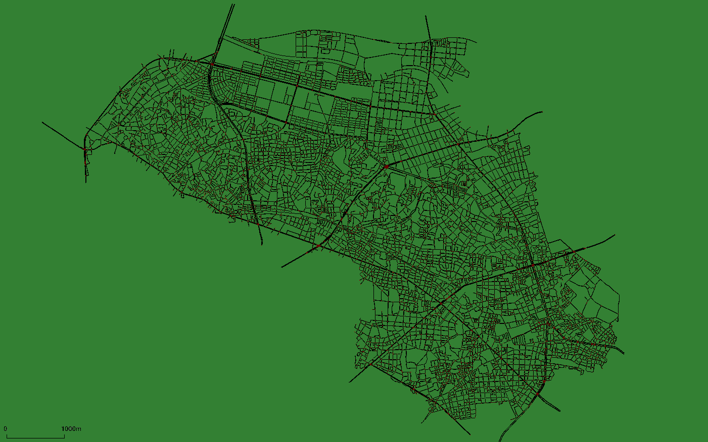
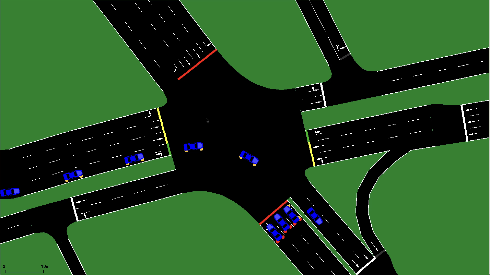

# Tokyo SUMO Traffic(ToST) Scenario
Contact: TBD

This project is licensed under the terms of the MIT license.

## Overview
ToST Scenario is realistic traffic scenario in part of Tokyo for SUMO (Simulator of Urban MObility).
This scenario is generated in SUMO version 1.14.1.

ToST Scenario includes map data and 12-hour traffic demand for Itabashi, a part of Tokyo.
Map data and traffic demand are simple: map data includes only the road network and traffic demand includes only general vehicles.

By using this scenario, you can run realistic simulation in Tokyo area.




## Publication
- TBD(一旦修論を載せてる)
- 山崎友路. ToST(Tokyo SUMO Traffic) scenario:現実的なモビリティパターンを再現した東京の交通シナリオの作成. Master’s thesis, 東京工業大学 情報理工学院 情報工学系 情報工学コース, jan 2023.

## Directory
- scenario
    - itabashi
        - map
            - Map data of Itabashi, a part of Tokyo
        - trip
            - Traffic demand from 7:00 to 19:00
            - The warm-up period includes the traffic demand from 6:00 to 7:00.
- misc
    - TBD

## How to
Simple simulation can be run with the following command.
```
sumo-gui --net-file scenario/itabashi/map/ToST_itabashi.net.xml --route-files scenario/itabashi/trip/ToST_0700_1900.trips.xml
```
The behavior after 19:00 is not taken into account.
And it is assumed to run with the following options.
Further option is [here](https://sumo.dlr.de/docs/sumo.html).
- --ignore-junction-blocker 15
- --device.rerouting.probability 1.0
- --device.rerouting.period 300

Please refer to the [SUMO wiki](https://sumo.dlr.de/docs/index.html) for further detailed simulations and data collecting methods.